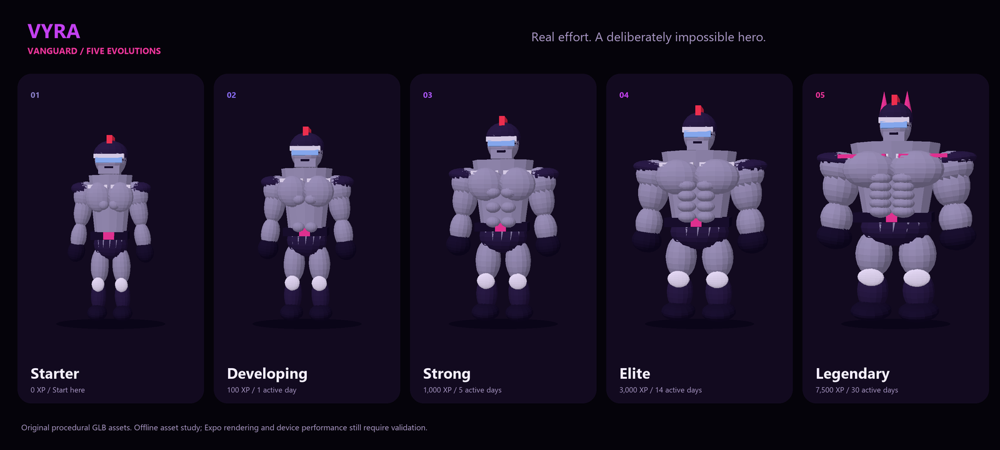

# VYRA

Real exercise powers a short fitness battle. Consistent workouts evolve Vanguard, an original, deliberately exaggerated 3D hero.

This repository implements the hackathon prototype: an Expo app, on-device pose capture, solo and private PvP services, persistent progression, five procedural GLB stages, cosmetics, and a participant-separated ML workflow. **The camera currently uses a labeled geometric baseline. No team-trained accuracy, completed physical-device demo, or production readiness is claimed.**

## Run locally

Use Node.js 22.13+ and npm. All commands below start in the repository root. The lockfile records the resolved dependencies. SDK 57 was selected against current Expo packages; check the Expo Go version on every demo device before relying on it.

```powershell
npm ci
npm run model:download
npm run build:capture
npm run db:local
npm run dev:worker
```

Leave the service running. In another terminal:

```powershell
npm run mobile:web
```

Open `http://localhost:8081`. In **Profile**, create a player against `http://localhost:8787`. The capture page is `http://localhost:8787/capture/`; its dataset recorder is `/capture/?lab=1`. Localhost is a secure camera context on that same computer. A phone needs a reachable **HTTPS** service; its `localhost` is not your computer.

For Expo Go:

```powershell
npm run dev
```

Scan the Expo QR using the appropriate Expo Go flow. Enter your deployed HTTPS Worker address in Profile, or set `EXPO_PUBLIC_API_URL` in `apps/mobile/.env` before starting Metro. See [deployment](docs/deployment.md). Never place credentials in an `EXPO_PUBLIC_` variable. Guest credentials use SecureStore on native devices; the web development preview uses localStorage.

If npm 10 fails while updating dependencies with `Cannot read properties of null (reading 'edgesOut')`, use `npx --yes npm@11.6.4 install`. This avoids changing the globally installed npm. A clean `npm ci` should use the supplied lockfile.

## Play

1. Create a persistent guest player in Profile.
2. Open the arena and calibrate both exercises with real practice reps. Keep the indicated joints in view; practice does not award XP.
3. Start a solo match or create a private room. A second player joins with the room code. Both players ready up.
4. Squats build guard; push-ups build attack. Follow the countdown, posture transition, and recovery cues. The server resolves damage together.
5. A completed match with at least ten accepted reps qualifies for rewards. Return to the collection to see earned progress and preview locked stages or cosmetics. Preview never grants ownership.

Connection loss, backgrounding, stopping, or leaving the battle interrupts the match without a winner or completion rewards. Both modes require a live service connection.

## Repository

| Location | Responsibility |
| --- | --- |
| `apps/mobile` | Expo Router screens, secure guest session, WebView bridge, battle HUD and native/web Three.js viewer |
| `apps/capture` | Trusted capture page, MediaPipe Lite, calibration, movement events and opt-in dataset recorder |
| `apps/worker` | Cloudflare APIs, authoritative SQLite Durable Objects, D1 ledger, constrained Workers AI |
| `packages/core` | Versioned contracts, pose features/inference, full-cycle counter, combat and progression rules |
| `ml` | Python data validation, fixed 3/1/1 participant split, MLP training/export/evaluation/promotion |
| `scripts` | Reproducible original character generation and static asset assembly |
| `docs` | Architecture, deployment, evidence, device checklist and product roadmap |

The hero GLBs are bundled in the app. `npm run assets:generate` rebuilds all five from the same articulated structure. They use simple materials and stable joints/attachments; runtime animations provide idle, flex and victory poses. There are no anatomical morph targets or production skeletal rigs.



This contact sheet is rendered offline from the bundled meshes. It is an asset review, not an Expo/device screenshot. Rebuild it with `python scripts/render-hero-study.py` using NumPy and Pillow.

## Check the implementation

```powershell
npm run worker:types
npm run typecheck
npm test
npm run assets:verify
npm run build
npm run export:all -w @vyra/mobile
node apps/worker/scripts/smoke.mjs
```

The Worker smoke command needs the local service running. Add `--full` for a timed solo protocol test, or `--pvp-full` for two independent player sockets, using synthetic rep messages and durable rewards. **These do not validate camera-controlled exercise.** Exporting native bundles does not compile native projects or prove Expo Go/device compatibility.

Training commands and acceptance gates are in [ml/README.md](ml/README.md). The synthetic numerical fixtures validate software math only and cannot be promoted as a team model. Record P01–P03 for training, P04 for validation and P05 for an untouched final test; do not shuffle frames across participants.

Read [validation status](docs/validation.md) for what actually ran, [demo runbook](docs/demo-runbook.md) for the five-person handoff, and [roadmap](docs/roadmap.md) for later milestones. Embedded capture must be tested on the actual Android, iPhone and iPad. The isolated Android SDK 54 fallback scaffold is documented in [capture/README.md](apps/capture/README.md); it remains a build/device spike, not a guaranteed fallback.

## Rules and limits

Both players start at 100 HP. Each squat adds 5% guard, capped at 40%; each push-up generates 8 attack. Received damage is rounded once after guard, both hits resolve simultaneously, and guard resets. Knockout or three pairs ends the match; tied HP gives a draw. Cosmetic rarity and evolution never affect combat.

The service owns scoring, phase deadlines and rewards. It deduplicates reps and commits rewards through a unique match/participant ledger, but client-reported movement remains a prototype trust boundary. Identity recovery, reconnect-to-play, public matchmaking, stronger abuse controls and robust anti-cheat are later work. No raw video is sent to the game server.

Cloudflare bindings target services with free allocations. Local mode deliberately disables remote AI; quota/unavailable conditions fall back to Balanced or display an explicit service error. Deployment requires an authenticated account and available quota; no paid plan is provisioned by these scripts.
