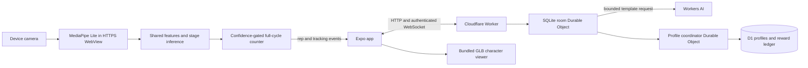
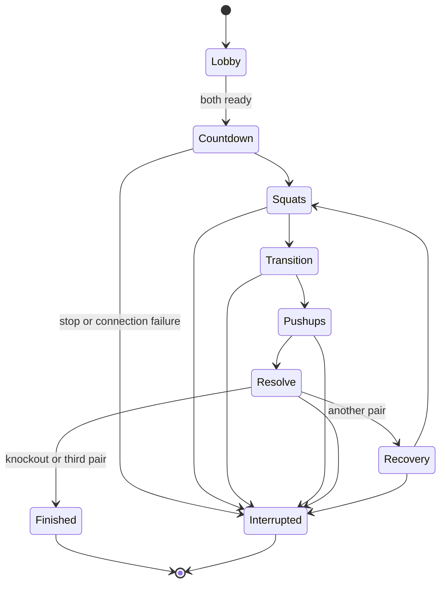

# Architecture and contracts

Video and body landmarks remain on the device during play. The opt-in lab exports landmark/feature JSONL files locally for the five-person dataset. Gameplay sends movement/tracking events, never camera frames.

`packages/core/src/contracts.ts` is protocol v1 for capture controls/events, model JSON, match commands/snapshots, AI decisions, profiles, inventory and receipts. Changes must be coordinated across capture, app and service. Epoch event time is converted using the client/server ping offset; camera frame monotonic time stays inside the movement pipeline. Each accepted rep belongs to one server phase ID and monotonically increasing participant sequence.

The pose detector is pretrained. The optional team MLP classifies top/bottom for two movements plus other. Shared JavaScript uses the exported feature order, training-only normalization, ReLU layers and softmax. The detector's visibility, MLP confidence and geometric form cue have different meanings. Tracking loss disarms a partial rep cycle; it is not a completed rep or a diagnosis of fatigue. Live loading rejects malformed or synthetic-test model artifacts.

## Match state

Scheduled server deadlines govern phases. Late alarm delivery cannot extend exercise time. A bounded two-second late-event window permits an event generated before the exercise deadline to settle; commands cannot alter completed rounds. Both damage totals use the same pre-resolution state. Bot targets for the pair are fixed before its squat phase and never chase the player's final score.

One room Durable Object owns both modes. Hibernating WebSockets and durable alarms preserve state; missing heartbeats interrupt rather than choose a winner. A single-use short-lived socket ticket prevents exposing a persistent guest bearer token in URLs. Finished receipts can be retrieved after reconnecting, but interrupted matches cannot resume playing in this prototype.

## Progression and persistence

Profile coordinators serialize D1 changes from different rooms and equipment changes for one account. A unique `(match_id, profile_id)` reward ledger, profile update, inventory changes and calendar history commit together. Repeated settlement returns the same receipt. Server-defined Asia/Kolkata dates and Monday-start weeks determine caps/bonuses; delayed older results cannot reset current-day counters. Earned stage is monotonic and requires both XP and distinct active days.

Rewards for each of the first three qualified daily matches are `50 + 5 × reps + 25 if won`; qualification requires a finished match and at least ten reps. The first active-day reward adds `10 × min(streak, 7)`. The three-active-day weekly goal adds 100 once. More workouts can retain completed repetitions/activity without bypassing the match-XP cap. Exact semantics and edge cases are covered by core and SQLite tests.

Preview stage and preview equipment are component state. Only the authenticated equip API can persist a cosmetic, after ownership validation. Neither preview nor rarity modifies combat statistics.

## Resource lifecycle

Capture unmounts/releases camera on navigation, backgrounding and interruption. Practice counters reset between exercises and on tracking loss. Hero canvases unmount when their screen loses focus; shared GLTF geometry is cached, cloned materials are disposed, and reduced-motion mode renders on demand. Battle screens use lightweight UI instead of running a second 3D canvas beside pose inference. Sustained heat, responsiveness, 30 FPS viewer interaction and repeated-navigation memory still require actual device measurements.
